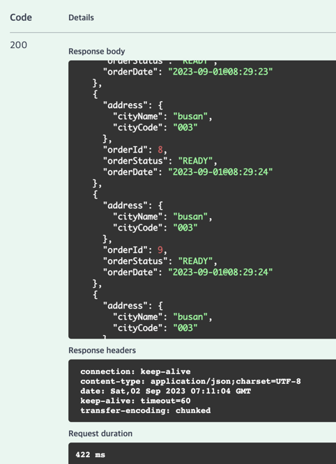
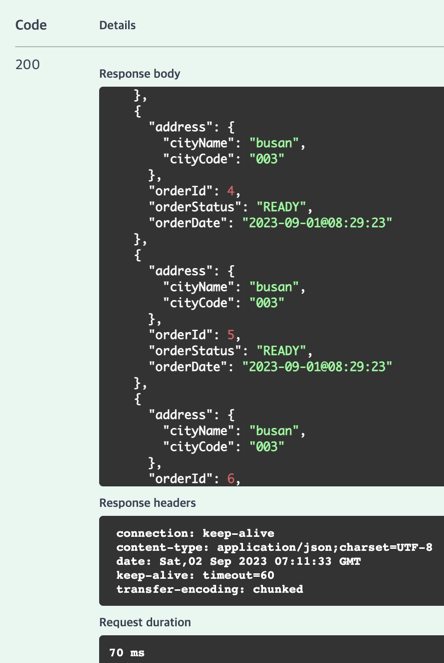

# docker desktop and docker-compose.yml 사용한 프로젝트
2023 summer study

* Spring Boot 3.x version 이상에서 docker-compose 파일을 이용하여 docker 이미지와 컨테이너 환경을 구성
* NoSQL인 Elasticsearch를 이용해서 데이터를 저장하고, 검색엔진으로서 사용
* 검색을 한 후 Redis Caching 기능을 적용.
* API의 Request는 Swagger을 사용. Spring Boot 3.x 이상에서는 Springdoc API를 사용해야 한다.
---

* **캐싱을 적용하기 전 422ms**

* **캐싱을 적용한 후 70ms** 

---
## env
* Mysql
  * version : latest
  * default port 사용 : 3306

* Redis
  * version : latest
  * default port 사용 : 6379

* Elasticsearch
  * version : 7.17.12
  * default port 사용 : 9200
    * 기본적인 ES CRUD
    * 입력받은 order의 검색
      * whildCard, NonWildCard 방식

* Kibana
  * version : 7.17.12
  * default port 사용 : 5601

### docker-compose.yml 파일 ###
  * https://gist.github.com/eomheeseung/46d7e5cdeeb913d58d66618684e87ed8

---
## TODO - WebFlux 전환

---
## Swagger
* Springdoc 사용, SpringFox (X)
